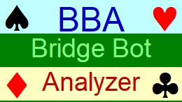

# Bridge Bot Analyzer (BBA)

<p align="center">
  
</p>

<p align="center">
  <strong>Bridge Bot Analyzer</strong> is a bridge analysis application, designed for evaluating bidding, play decisions and performance of bridge bots.
</p>

---

## Features

- Analysis of contract bridge deals
- Evaluation of bidding decisions and card play
- Fast deal processing and analysis
- Designed for bridge players, testers, and bot developers


## Repository Contents

This repository contains:

- Native Windows application binaries
- EPBot engine libraries
- Configuration and integration files

The main BBA application is distributed as a native Windows executable.  
Included EPBot libraries provide support for cross-platform integration and experimentation.

| File / Directory | Description |
|---|---|
| `BBA.exe` | Main application executable |
| `BBA.zip` | Compressed distribution package |
| `EPBot64.dll` | EPBot library for 64-bit systems |
| `EPBot86.dll` | EPBot library for 32-bit systems |
| `EPBotARM64.dll` | EPBot library for ARM64 systems |
| `EPBot64.tlb` | COM type library for the 64-bit EPBot library |
| `EPBot86.tlb` | COM type library for the 32-bit EPBot library |
| `EPBotARM64.tlb` | COM type library for the ARM64 EPBot library |
| `Native-libraries/` | Native libraries for Windows, Linux, macOS, and WebAssembly (WASM) |

---
## System Requirements

- Windows
- Supported architectures:
  - x86
  - x64
  - ARM64
- Microsoft Visual C++ Redistributable (if required)

---

## Installation

1. Download the latest release package.
2. Extract `BBA.zip`.
3. Launch the application.

---

## Running the Application

```bash
BBA.exe
```

---

## Project Website

Official website:

- https://sites.google.com/view/bbaenglish

---

## Bug Reports & Suggestions

If you find a bug or want to suggest an improvement:

1. Open the **Issues** tab
2. Create a new issue
3. Describe the problem and steps to reproduce it

---

## Releases

All published versions are available in the repository **Releases** section.

---

## License

No explicit license is currently provided in this repository.

If you intend to use this software commercially or redistribute it, please contact the repository owner.

---

## Author

Developed and maintained by Edward Piwowar.

GitHub Repository:

- https://github.com/EdwardPiwowar/BBA

---

Bridge Bot Analyzer is a tool created for contract bridge enthusiasts, allowing advanced bridge analysis and experimentation with bridge-playing algorithms.

